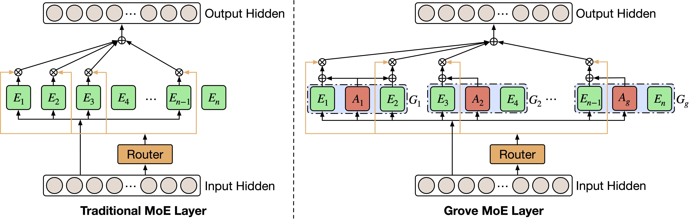
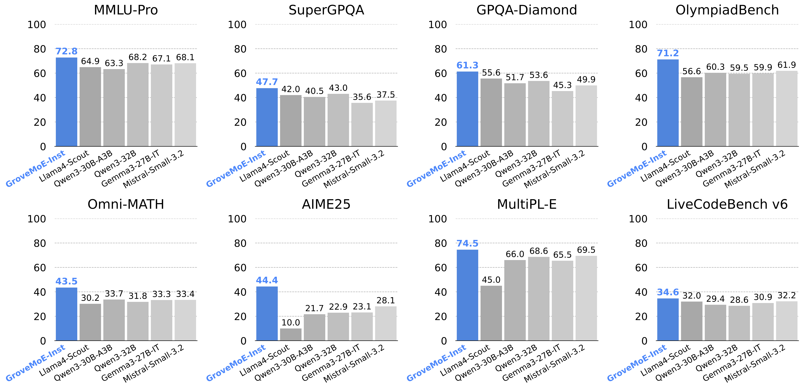

<div align="center">
<h1><strong>GroveMoE</strong></h1>
</div>
<!-- [](https://arxiv.org/abs/2508.07785)
[](https://huggingface.co/inclusionAI) -->

<p align="center">
🤗 <a href="">Hugging Face</a>&nbsp&nbsp | &nbsp&nbsp 📑 <a href="https://arxiv.org/abs/2508.07785">Paper</a> &nbsp&nbsp | &nbsp&nbsp 🔗 <a href="https://github.com/inclusionAI/GroveMoE">Github</a>&nbsp&nbsp

## Overview

GroveMoE is an **open-source** family of large language models developed by the **AGI Center, Ant Group Research**  that introduces **Grove MoE**, a new sparse architecture using **adjugate experts** for dynamic computation allocation.  
With **33 B total parameters** and **3.14–3.28 B active parameters per token**, GroveMoE delivers **state-of-the-art** results across reasoning, mathematics, and code generation while keeping inference costs low.  
**⚠️ Model weights are comming soon.**

<p align="center"></p>

---

## Key Highlights
| Feature | Description |
|---------|-------------|
| **Architecture** | Novel **adjugate experts** grouped with ordinary experts; shared computation is executed once, then reused, cutting FLOPs. |
| **Sparse Activation** | 33 B params total, only **3.14–3.28 B active** per token. |
| **Training** | Mid-training + SFT, up-cycled from **Qwen3-30B-A3B-Base**; preserves prior knowledge while adding new capabilities. |
| **Open** | Weights, configs will be fully released under Apache 2.0 upon approval. |

---

## Benchmark Results

<p align="center"></p>

---

## Citation
If you find our work helpful, feel free to give us a cite.
```bibtex
@article{grovemoe2025,
title = {GroveMoE: Towards Efficient and Superior MoE LLMs with Adjugate Experts},
author = {Wu, Haoyuan and Chen, Haoxing and Chen, Xiaodong and Zhou, Zhanchao and Chen, Tieyuan and Zhuang, Yihong and Lu, Guoshan and Zhao, Junbo and Liu, Lin and Huang, Zenan and Lan, Zhenzhong and Yu, Bei and Li, Jianguo},
journal = {arXiv preprint arXiv:2508.07785},
year = {2025}
}
```